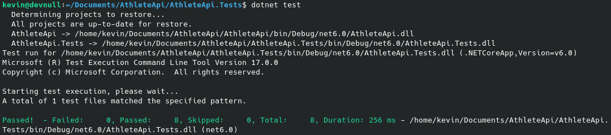
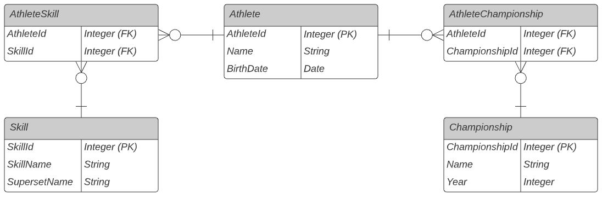

# Athlete Api
This is my solution for the data storage assignment. You can read a the assignment [here](./doc/assignment.md). The project uses .NET 6 and PostgreSQL.

## Running the project
You can run the project using docker-compose. To do so, run the following command in the root of the repository:
```
docker-compose up
```
This will run both the api and the database for you. The database already provides you with some test data. You don't need to install .NET 6 or PostgreSQL. The api runs on *http://localhost:5274/api/v1/athletes*.

### Available filters
These are the availble filters. They can be used as a HTTP query parameter.
```
 - name: string (does a lowercase contains comparison)
 - skill: string
 - minAge: number
 - maxAge: number
 - minYearsOfExperience: number
```
Here are some examle queries:
```
# People that are called anna
http://localhost:5274/api/v1/athletes?name=anna

# People that are between 20 and 30 years old
http://localhost:5274/api/v1/athletes?minAge=20&maxAge=30
```
The test project contains more examples.

### Running the tests
The project also includes some tests. You need to have .NET 6 installed to run them. *The api needs be running in docker-compose for the tests to work*. You can run the tests by using the following command in the test project.
```
dotnet test
```
I've included a screenshot of the test results below for those that don't have .NET 6 installed.



## The solution's design
### The database design
The image below shows the database's design. The athlete table has a many-to-many relationship to skills and championships.


### EF Core queries
The database is queried with the Entity Framework. This ORM has a neat feature that allows you to gradually construct queries as shown in the example below.
```
var athletes = _context.Athletes.AsQueryable();

if (!string.IsNullOrEmpty(nameQuery))
{
    athletes = athletes.Where(w => w.Name == nameQuery);
}

return athletes.toList();
```
Entity Framework only executes your query once you run the ```.ToList()``` method. This means that we can split the query up into multiple statements to make it more readable.

### A more maintainable way to do things
I wrote the logic for this assignment myself. This is fine when you have only 5 filters, but the code complexity grows as you add more fields and filters to your model. In the real world you may want to tackle this problem with an existing library like [OData](https://docs.microsoft.com/en-us/odata/overview) for the following reasons:
- Clients will ask for more filter options in the future, and with OData you don't have to program every filter yourself.
- The code becomes more maintainable. An OData search endpoint can be added in as little as four lines of code.
- The query syntax for the REST API will follow an existing standard, which is easier for both the maintainer and the consumer of the API.

### The filter syntax
I chose to keep it the filter syntax simple by creating a seperate query parameter for every possible filter. I could've opted for a json filter like the example below.
```
/api/v1/athletes?filters=[{field:'age',op:'gt',value:25}]
```
This is a more flexible solution, but it would also require you to use reflection, which I would not recommend for a simple endpoint of only 5 filters. This solution would be better once your endpoint grows in complexity and requirements, but I personally think that a preexisting solution like OData would be easier to use and more maintainable in the long run.
